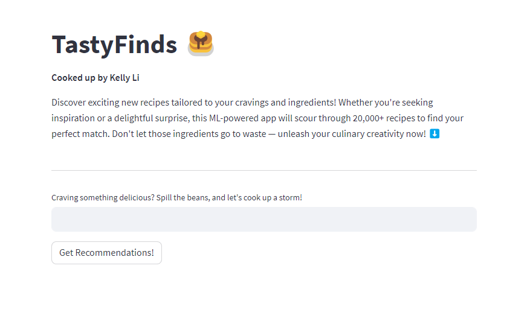
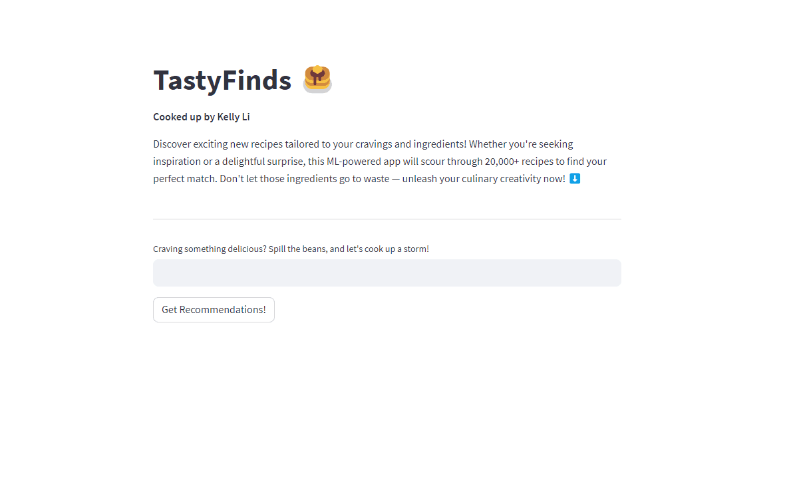

# Recipe Recommender System: [TastyFinds](https://kellyli-tastyfinds.streamlit.app/)
<!-- TABLE OF CONTENTS -->
<details>
  <summary>Table of Contents</summary>
  <ol>
    <li>
      <a href="#about-the-project">About The Project</a>
      <ul>
        <li><a href="#built-with">Built With</a></li>
      </ul>
    </li>
    <li>
      <a href="#getting-started">Getting Started</a>
      <ul>
        <li><a href="#prerequisites">Prerequisites</a></li>
        <li><a href="#installation">Installation</a></li>
      </ul>
    </li>
    <li><a href="#usage">Usage</a></li>
    <li><a href="#what-did-i-learn">What Did I Learn?</a></li>
    <li><a href="#challenges-faced">Challenges Faced</a></li>
    <li><a href="#future-directions">Future Directions</a></li>
    <li><a href="#contributing">Contributing</a></li>
    <li><a href="#license">License</a></li>
    <li><a href="#contact">Contact</a></li>
    <li><a href="#acknowledgments">Acknowledgments</a></li>
  </ol>
</details>


## About The Project

This project aims to create an intelligent and personalized recipe recommendation system, catering to users' individual preferences and dietary needs. Leveraging advanced data science techniques like Word2Vec, Word Embeddings Neural Network, TF-IDF, and FunkSVD, the system provides users with enticing and relevant recipe suggestions, inspiring culinary creativity.

<br>

<div id="header" align="center">
    
</div>

<br>

### Built With

- Python
- Jupyter Notebook
- Scikit-learn
- NumPy
- Pandas
- Surprise
- Streamlit

## Contents
### Main Files: Project Structure

1. [Data Preprocessing](https://github.com/kli210/recipe_recommender_capstone/blob/main/data_preprocessing.ipynb)
2. [EDA](https://github.com/kli210/recipe_recommender_capstone/blob/main/EDA.ipynb)
3. [Modelling](https://github.com/kli210/recipe_recommender_capstone/blob/main/modelling.ipynb)
4. [Advanced Modelling](https://github.com/kli210/recipe_recommender_capstone/blob/main/advanced_modelling.ipynb)
5. [Web App](https://github.com/kli210/recipe_recommender_capstone/blob/main/app_reciperecs.py)

## Getting Started

### Prerequisites

- Python (version 3.8 or up)
- Jupyter Notebook
- Git

### Installation

1. Clone the repository
   ```sh
   git clone https://github.com/kli210/recipe_recommender_capstone.git
   ```
2. Navigate to the project directory
   ```sh
   cd recipe_recommender_capstone
   ```
3. Install required packages
   ```sh
   pip install -r requirements.txt
   ```

## Usage

Explore how the Recipe Recommender can transform your cooking experience with just a few clicks! Using natural language, you can effortlessly find recipes that match your specific cravings. Watch as the magic happens:

Simply enter your request in everyday language. For example, type in "Japanese soba noodle dishes that are vegetarian."
Witness the power of our recommendation system in action! The web app processes your query, intelligently analyzing the ingredients, descriptions, and more to deliver personalized results.
Instantly receive the top 5 vegetarian dishes that closely align with your request. Say goodbye to tedious searches and hello to a tailored culinary adventure.

<br>

<div id="header" align="center">
    
</div>

<br>

Whether you're looking for a quick weeknight meal or aiming to impress with a gourmet creation, this Recipe Recommender is your sous chef in the digital world. Experience the ease of finding recipes that match your cravings and preferences like never before! Try it out [here](https://kellyli-tastyfinds.streamlit.app/).

### What Did I Learn?

During this capstone project, I gained valuable insights and skills in various aspects of data science and machine learning:

- **Data Preprocessing and Feature Engineering**: I learned how essential data preprocessing and feature engineering are in creating a solid foundation for machine learning models. This involved handling outliers, duplicated entries, and missing values, and transforming raw data into a usable format.

- **Exploratory Data Analysis (EDA)**: Through exploratory data analysis, I discovered the power of visualizations to uncover trends, correlations, and insights within the data. This step provided valuable context for building effective recommendation models.

- **Machine Learning Techniques**: I employed a range of machine learning techniques, including content-based modeling using word embeddings and TF-IDF. This allowed me to understand how models learn from text data and make recommendations based on user input.

- **Collaborative Filtering and Personalization**: Implementing the FunkSVD-based collaborative filtering model taught me about personalized recommendations. By incorporating user search history and ratings, I understood how to create a more tailored user experience.

- **Deployment with Streamlit**: I successfully deployed my recommendation models using Streamlit, enabling users to interact with the models through a user-friendly web application. This experience broadened my understanding of deploying machine learning projects for real-world use.

### Challenges Faced

While working on this project, I encountered a few challenges that further enhanced my problem-solving skills:

1. **Data Collection and Quality**: Finding and accessing the right data, including dealing with missing values and outliers, underscored the importance of data quality for accurate analysis and modeling.

2. **Computational Limitations**: Handling large volumes of data on a local machine presented computational challenges. This required me to strategically sample data for local analysis and modeling.

### Future Directions

Looking ahead, there are exciting possibilities to build upon this project:

- Implementing Funksvd for returning users to enhance personalization.
- Including URLs to recipes for users to access recipe details.
- Incorporating more parameters into the recommendation model, such as nutritional values and recipe complexity.
- Exploring advanced deep learning techniques for text data analysis.
- Scaling the project to handle larger datasets using cloud-based resources.

Through this capstone project, I not only honed my technical skills but also gained a deeper understanding of the entire data science process, from data collection and preprocessing to modeling and deployment. This experience has been invaluable in preparing me for real-world data science challenges.

## License

This project is licensed under the MIT License - see the [LICENSE](LICENSE.txt) file for details.

## Contributing

Contributions are warmly welcomed! If you have any suggestions, ideas, or improvements that would enhance this project, please don't hesitate to get involved. Feel free to open an issue to discuss your thoughts or submit a pull request with your proposed changes. Your valuable input can help make this project even better.

## Contact

Kelly Li - [kellyli210.kl@gmail.com](mailto:kellyli210.kl@gmail.com)

Project Link: [https://github.com/kli210/recipe_recommender_capstone](https://github.com/kli210/recipe_recommender_capstone)

My personal website: [https://kelly-li.netlify.app/](https://kelly-li.netlify.app/)

### Acknowledgments

I would like to extend my heartfelt gratitude to the following individuals and resources, whose support, guidance, and resources were instrumental in the successful completion of this project:

- **BrainStation Instructors & TAs**: Thank you for your insightful guidance and continuous support throughout this project.
- **Food.com**: The invaluable dataset posted on [Kaggle](https://www.kaggle.com/datasets/shuyangli94/food-com-recipes-and-user-interactions?select=PP_users.csv) served as the foundation of this project.
- **Online Communities**: The vibrant communities on platforms like Stack Overflow, Reddit, and GitHub, where I found solutions to various challenges.
- **Friends and Family**: My loved ones who offered encouragement and understanding during the ups and downs of this project.
- **Blogs**: [Jack Leitch's blog](https://towardsdatascience.com/building-a-recipe-recommendation-system-297c229dda7b) specifically, for his inspiring work in the field of recipe recommendation. The ML techniques and approach used in my project were inspired by their insightful contributions.

Your contributions have greatly enriched this project, and I am truly grateful for your involvement.

Happy cooking and happy coding!

<br>

*Cheers,*

*Kelly* c:

